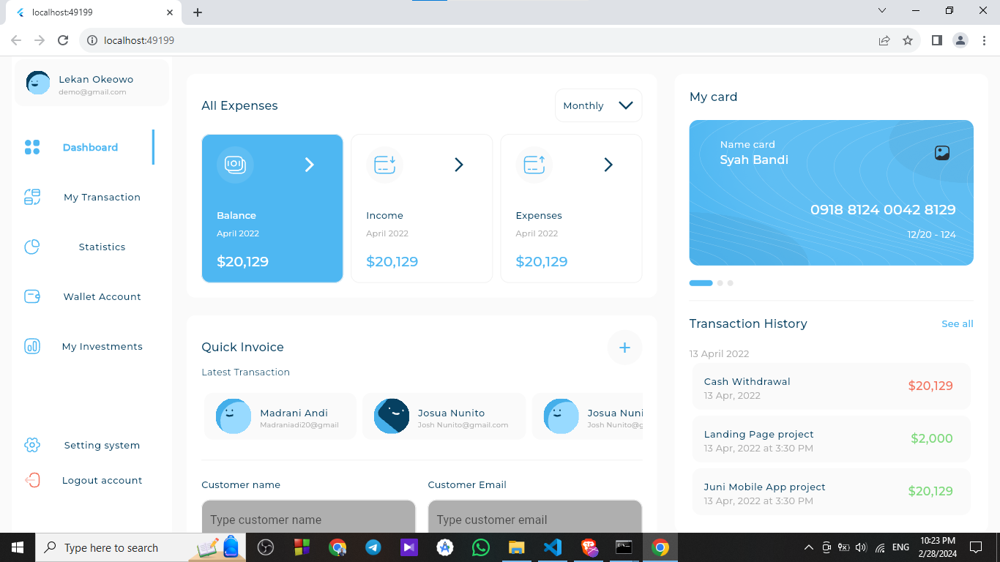
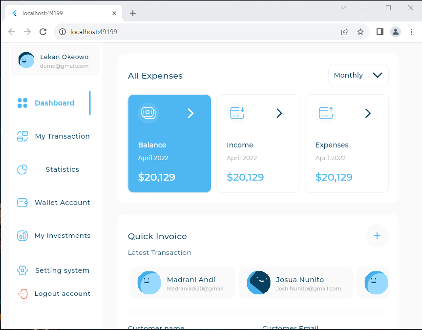
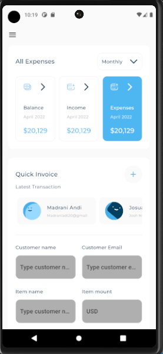

# responsivedashboard

A new Flutter project.

## Getting Started

"This project is a Responsive Dashboard Application designed to work on different devices, such as:
 -  DeskTop

    

 -  Tablet 
    
    
 -  Mobile 

    

